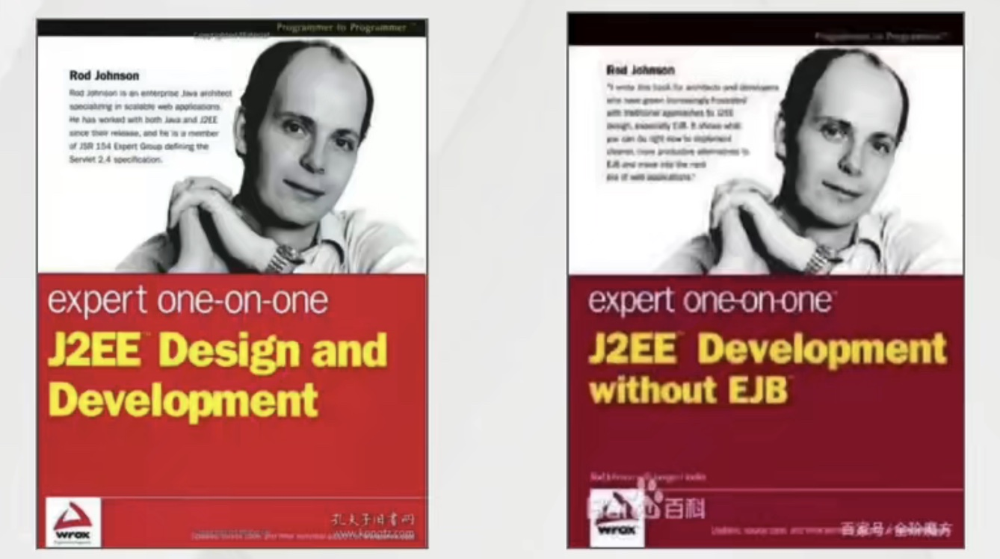
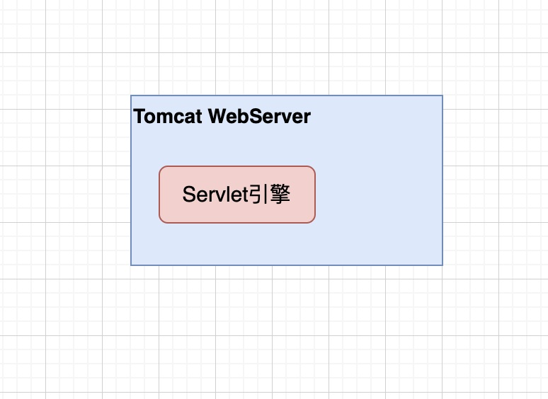

# SpringFramework

### 1、什么是SpringFramework?

​	**2002年，Rod Johnson撰写了一本名为《J2EE设计和开发》的书(图左)。本书主要概括了当时Java企业应用程序开发的现状以及指出了JavaEE规范中** **EJB框架的缺陷** **，并在书中基于普通Java类和设计模式提出了更为简单的解决方案 (interface21)。同年在《J2EE Development Without EJB》一书中(图右)，他进一步拓展了Interface21的代码，衍生而来了一个 轻量级J2EE开发解决方案--Spring。2004年3月在Sourceforge正式发布了Spring框架的第一个版本。目前SpringFramework最新版本为5.x**

### 2、EJB框架

#### 2.1 EJB简介

​	EJB (Enterprise Java Beans) 是基于分布式事务处理的企业级应用程序的组件。Sun公司发布的文档中对EJB的定义是：EJB是用于开发和部署多层结构的、分布式的、面向对象的Java应用系统的跨平台的构件体系结构，EJB部署于应用服务器端的EJB容器中

#### 2.2 缺陷

1. 运行环境苛刻，为什么说运行环境苛刻？

   - 以现在的Java开发来讲主要开发的是JavaWeb应用，那既然是JavaWeb应用在运行的时候就必须要一个运行环境也就是服务器。

   - 目前常用服务器则是采用Tomcat，我们写好的代码都直接运行在Tomcat当中，Tomcat会集中处理请求与响应包括完成Servlet以及相关代码的运行和解析。

   - 作为整合Tomcat来讲最为核心的内容就是Servlet引擎，所有Tomcat最为核心的功能都是交给Servlet引擎来完成，这样Tomcat就能让我们的代码处理web相关的一些工作和内容，所以Tomcat也被称为WebServer

     

   - EJB代码对环境的要求是比较苛刻的是不可能把代码直接运行到Servlet引擎当中

2. 代码移植性差
