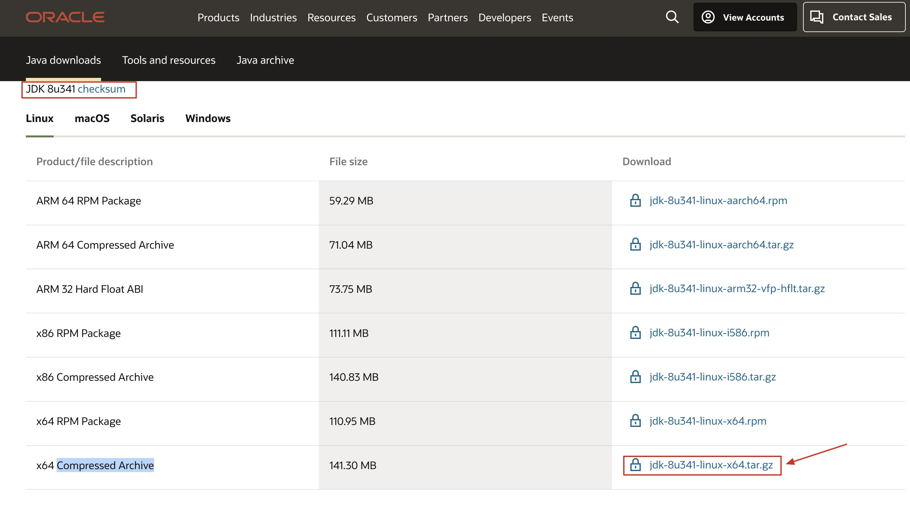

# Linux7.6安装JDK1.8

## 1.下载

点击 ☞ [官网](https://www.oracle.com/java/technologies/downloads/#java8) 选择对应系统进行下载



## 2.检查是否自带JDK

```shell
# java -version 用来查看已经安装的JDK版本 
java -version 

# 用命令查看java相关的文件
rpm -qa | grep java

# rpm 软件包管理器    
# -qa 使用询问模式，查询所有套件
# grep 查找文件里符合条件的字符串
# java 查找包含java字符串的文件

# 如存在对应包则需一个一个删除
rpm -e --nodeps 包名
```

### 3.安装配置

1. 在`/usr/local/`下新建java目录

   ```shell
   cd /usr/local
   mkdir java
   
   # 或者直接一步到位
   mkdir /usr/local/java
   ```

2. 上传并解压

   ```shell
   # 把下载好的压缩包上传至 /usr/local/java 目录下然后进行解压
   tar -zxvf jdk-8u341-linux-x64.tar.gz
   
   # tar备份文件
   # -zxvf&emsp;&emsp;&emsp;&emsp;&emsp;
   # -z通过gzip指令处理备份文件
   # -x从备份文件中还原文件
   # -v显示指令执行过程
   # -f指定备份文件
   # jdk-8u201-linux-x64.tar.gz文件名
   
   
   # 解压后删除压缩包
   rm -f jdk-8u341-linux-x64.tar.gz
   
   # rm 删除文件或目录
   # -f 强制删除文件或目录 
   ```

3. 配置

   ```shell
   # 编辑配置文件(vim 文本编辑  /etc/profile 编辑的文件)
   vim /etc/profile
   
   
   # 在文本最后一行输入以下内容
   # java environment
   export JAVA_HOME=/usr/local/java/jdk1.8.0_341
   export CLASSPATH=.:${JAVA_HOME}/jre/lib/rt.jar:${JAVA_HOME}/lib/dt.jar:${JAVA_HOME}/lib/tools.jar
   export PATH=$PATH:${JAVA_HOME}/bin
   
   
   # 保存后刷新配置文件使其生效
   source /etc/profile
   
   # 校验
   java -version
   java
   javac
   ```

   