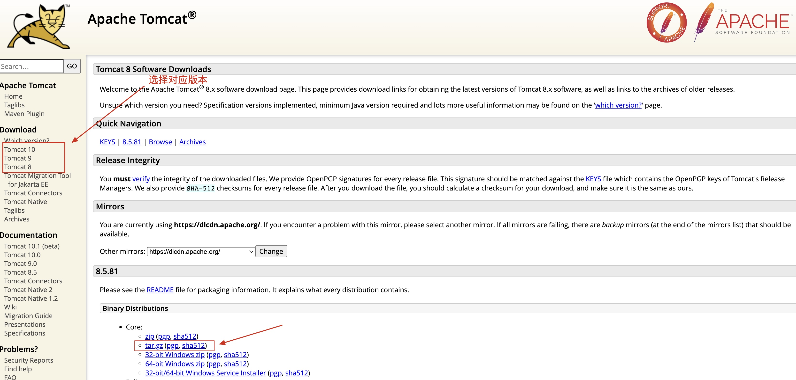

# Linux7.6安装Tomcat8

## 1.下载

点击 ☞ [Tomcat官网](https://tomcat.apache.org/download-80.cgi) 选择对应系统进行下载



## 2.安装与配置

1. 因为 `tomcat` 的安装依赖于 `Java Jdk`，所以需先判断是否安装JDK并配置了环境变量，如未安装可查看[Linux安装Jdk](./Linux7.6安装Jdk8.md)

   ```shell
   # 检查是否安装jdk
   java -version 
   
   # 查看jdk安装目录
   echo $JAVA_HOME
   ```

2. 上传并解压

   ```shell
   # 在 /usr/local/ 目录下新建tomcat目录并把压缩包上传至tomcat目录下
   tar -zxvf apache-tomcat-8.5.81.tar.gz
   
   # 解压后删除安装包
   rm -f tar -zxvf apache-tomcat-8.5.81.tar.gz
   
   # 把解压后的包移动并重新命名(可选)
   mv apache-tomcat-8.5.81 /user/local/tomcat/
   ```
   

3. 配置环境变量

   ```shell
   # 编辑配置文件
   vim /etc/profile
   
   # 配置安装路径
   export CATALINA_HOME=/usr/local/tomcat
   
   # 加入到path中
   export PATH=$PATH:$JAVA_HOME/bin:$CATALINA_HOME/bin
   
   # 刷新配置信息
   source /etc/profile
   ```

4. 防火墙设置

   ```shell
   # 永久开放80端口(开放端口才能在外部访问得到tomcat启动页)
   firewall-cmd --zone=public --add-port=80/tcp --permanent
   
   # 重新加载防火墙
   firewall-cmd --reload
   ```

5. 启动tomcat

   ```shell
   # 启动tomcat
   /usr/local/tomcat/bin/startup.sh
   
   # 停止tomcat
   /usr/local/tomcat/bin/shutdown.sh
   ```